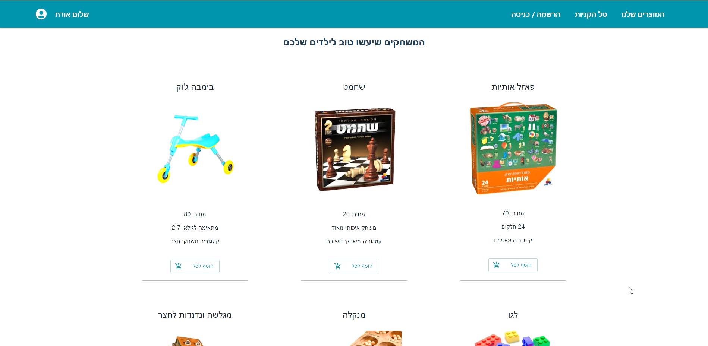
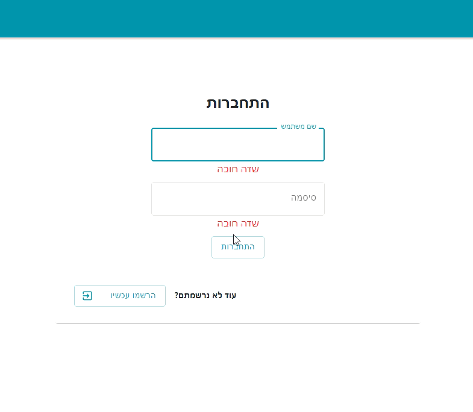
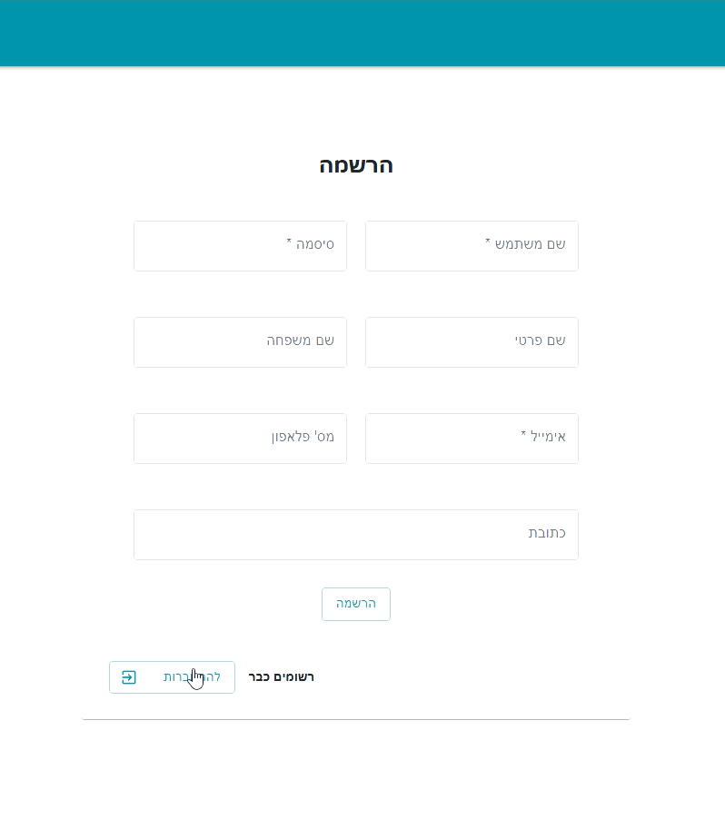

# 🧩 Game Ordering Web App 

A full-stack web application for ordering games online – built with **React**, **Node.js**, and **MySQL**.

## 🧠 About the Project
This project was developed as a final assignment in my studies 🎓
The goal was to build a real-world full-stack application with authentication, role management, form validation, and a friendly user experience.

## ✨ Features

- Role-based access: Admin / Customer.
- JWT authentication and password encryption.
- Client & server-side validation with friendly error messages.
- Shopping cart for guests (saved in LocalStorage).
- Order management and profile editing for registered users.
- Admin dashboard to add, edit, and delete products.
- Communication via RESTful API.

## 🛠️ Technologies

- **Frontend**: React, HTML, CSS  
- **Backend**: Node.js, Express  
- **Database**: MySQL  
- **Auth**: JWT, bcrypt  
- **Storage**: LocalStorage (cart)  

## 🚀 Getting Started

- Clone the repo `git clone https://github.com/TalorBuchris/game-store-web.git`
- Install dependencies  
`npm install`
- Set up the database using the provided schema
- Start the server and client  
```
node app.js  
npm run dev
```
## 👤 Test Credentials
To explore the application as a test user, you can use the following credentials:

**User account**  
Username: טל דבורה  
Password: Tt1!  

**Admin account**  
Username: טלאור  
Password: Tt1!  

## 📦 Folder Structure
📁 client → React frontend  
📁 server → Node.js  
📁 db → MySQL  
📁 screenshots → Images of the application's UI and workflow  
📄 README.md → This file  

## 📸 Screenshots
**HomePage - USER/guest**  


**Login**  


**Registration**  


For additional screenshots, please check the `screenshots` folder.

#### ⭐Thank you for visiting! Feel free to star the repository if you found it helpful or interesting.
